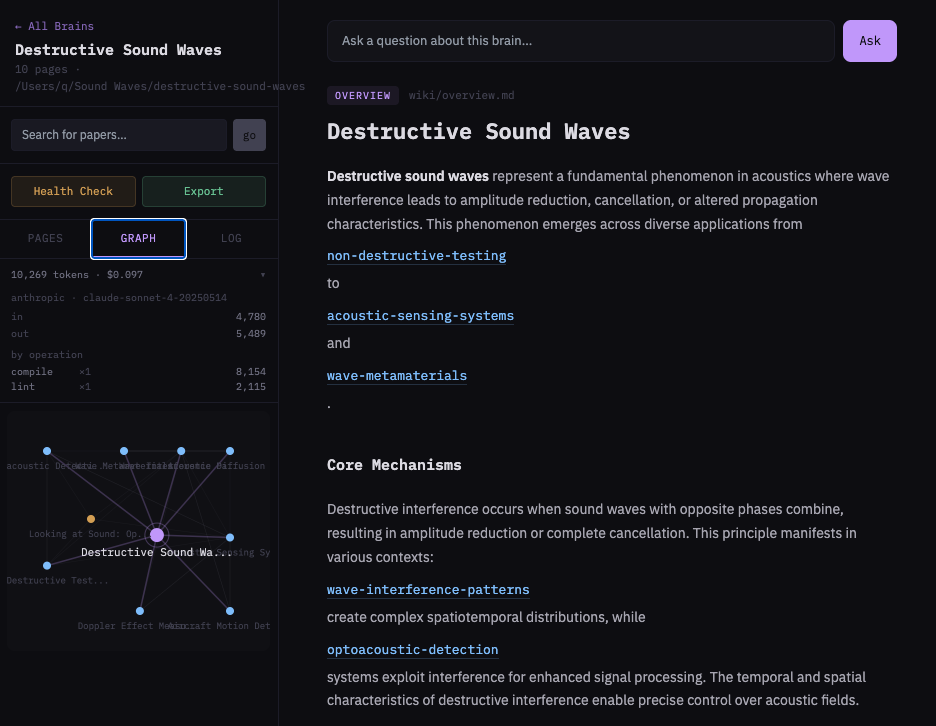

# Distill

**Type a research topic — or upload course PDFs. Get an interlinked wiki of the field, built from real papers and documents, on your filesystem.**

Distill searches Semantic Scholar, arXiv, and OpenAlex for papers on your topic, lets you curate which ones to include, then uses an LLM to compile them into a structured, cross-referenced wiki — overviews, concept breakdowns, entity profiles, source summaries — all as real `.md` files you can open in Obsidian or any editor. You can also upload PDFs (syllabi, lectures, readings) and Distill will classify them, extract a course structure, and compile a curriculum wiki.

Built on the [compiled wiki pattern](https://gist.github.com/karpathy/442a6bf555914893e9891c11519de94f) described by Andrej Karpathy.



## Who is this for

Anyone who learns from academic papers and wants to retain what they find. The tedious part of building a knowledge base isn't reading — it's the bookkeeping. Cross-referencing, tracking what contradicts what, keeping an index updated, linking related concepts. Distill handles that so you can focus on the thinking.

- **Researchers and grad students** doing literature reviews
- **Engineers** surveying a new field or technology
- **Teams** onboarding new members who need to get up to speed on a domain
- **PKM enthusiasts** who want structured, interlinked notes from real sources
- **Anyone** who's ever had 40 browser tabs of papers open and wished something would just organize it

## Why

Most AI + documents tools are stateless. You upload files, ask a question, get an answer. Next session, you start from zero. The tool forgets everything it just figured out.

This is the fundamental problem with RAG: it re-derives knowledge on every single query. Every time you ask a question, the system re-reads your entire corpus, re-identifies the relevant sections, and re-generates an answer. Nothing accumulates. There's no memory, no structure, no cross-referencing — just a fresh answer built from scratch every time.

Distill does the opposite. Instead of re-reading everything on every question, it **compiles the knowledge once** into a persistent wiki. The LLM reads your papers, identifies the key concepts, entities, and findings, and writes them into interlinked pages that live on your filesystem. When you add a new paper, Distill doesn't start over — it reads the new source, updates the pages that need updating, creates new ones where needed, and rebuilds the cross-references.

The result: your knowledge base gets richer over time instead of resetting to zero. Contradictions between papers are flagged. Gaps in coverage are identified. The synthesis compounds with every paper you add — and you own every word of it as plain markdown.

## How is this different

| | ChatGPT / NotebookLM | Elicit | Distill |
|---|---|---|---|
| Paper search | Manual upload | Built-in search | Built-in, 3 sources in parallel + PDF upload |
| Knowledge persistence | None — answer and forget | Table of summaries | Persistent interlinked wiki |
| Cross-references | None | None | Auto-generated `[[Wiki Links]]` |
| Output format | Chat messages | Spreadsheet rows | Real `.md` files on your filesystem |
| Add more papers later | Start over | Append rows | Wiki pages update and new ones are created |
| Portability | Locked in the app | Export CSV | Plain folders — Obsidian, git, any editor |
| Runs locally | No | No | Yes, with your own API key |

## Quick Start

```bash
git clone https://github.com/YOUR_USERNAME/distill.git
cd distill
cp .env.example .env.local
# Add your Anthropic or OpenAI API key to .env.local
npm install
npm run dev
```

Open [http://localhost:3000](http://localhost:3000). Create a brain, pick a topic, and you'll have a compiled wiki in a few minutes.

## How It Works

### 1. Create a brain

Give it a name and a research topic. Pick a folder on your filesystem where you want it to live — Distill creates a clean directory structure there with subdirectories for wiki pages, raw sources, and exports.

### 2. Search and curate papers

Distill fans out to three academic databases in parallel — Semantic Scholar, arXiv, and OpenAlex — and returns a deduplicated, ranked list of papers. You see each paper's title, authors, year, citation count, abstract, and which database it came from. Uncheck anything that's off-topic or low quality. Search for more papers if the initial results don't cover what you need.

### 3. Compile the wiki

Hit compile and the LLM reads every selected paper's abstract and metadata, then generates a set of interlinked wiki pages:

- **Overview** — a synthesis page covering the entire topic across all sources
- **Concept pages** — one per key idea, technique, or method. Explains what it is, why it matters, and how it connects to other concepts
- **Entity pages** — specific models, datasets, systems, or organizations
- **Source summaries** — each paper's key contributions, methods, findings, and significance
- **Lecture pages** — when created from uploaded course PDFs, one per lecture covering its content and connections

Every page uses `[[Wiki Links]]` to reference other pages. The overview links to all concepts and entities. Concept pages link to each other. Source summaries link to the concepts they discuss. The result is a navigable knowledge graph, not a flat list.

### 4. Grow the wiki over time

Find a new paper three weeks later? Search for it in the sidebar, add it, and Distill updates the existing pages and creates new ones. The wiki accumulates knowledge instead of starting over.

**Ask questions** against the compiled wiki. Distill uses the wiki pages as context (not the raw papers), so queries are fast and cheap. Save any answer as a new analysis page in the wiki.

**Run health checks** to find issues: orphan pages with no inbound links, contradictions between sources, missing cross-references, concepts mentioned but never given their own page.

**Export** the brain as a `.tar.gz`, or just open the folder in Obsidian — Distill auto-generates the vault config, page aliases, and graph color-coding so it works out of the box.

### What you get on disk

Every brain is a plain folder of markdown files:

```
my-research-topic/
├── SCHEMA.md              # wiki conventions
├── index.md               # auto-maintained catalog of all pages
├── log.md                 # timeline of every operation
├── README.md              # orientation for Obsidian users
├── raw/                   # immutable source documents
│   ├── vaswani-2017.md
│   ├── devlin-2019.md
│   └── pdfs/              # uploaded PDF files
├── wiki/                  # LLM-generated pages
│   ├── overview.md
│   ├── concepts/
│   │   ├── attention-mechanism.md
│   │   └── transfer-learning.md
│   ├── entities/
│   │   └── bert.md
│   ├── sources/
│   │   ├── vaswani-2017-summary.md
│   │   └── devlin-2019-summary.md
│   ├── lectures/           # lecture pages (from uploaded PDFs)
│   └── analyses/
├── exports/
└── .obsidian/             # vault config for Obsidian
```

No database. No cloud. Just files you own.

## Features

- **Three academic sources** — Semantic Scholar, arXiv, and OpenAlex searched in parallel and deduplicated
- **PDF upload** — upload syllabi, lectures, and readings to create a curriculum wiki, or add PDFs to an existing brain
- **Paper curation** — review and select papers before the LLM touches anything
- **Interlinked wiki pages** — `[[Wiki Links]]` throughout, cross-referenced automatically
- **Obsidian-ready** — auto-generates vault config, page aliases, and graph color-coding by page type
- **Ask questions** — query the wiki and save answers as new analysis pages
- **Health checks** — find orphan pages, contradictions, missing links, and coverage gaps
- **Token tracking** — see cost per operation and how much you save vs. raw-document approaches
- **Export** — download any brain as a `.tar.gz`
- **BYO API key** — works with Anthropic Claude or OpenAI. Nothing leaves your machine except API calls.

## Configuration

```env
# Use ONE of these:
ANTHROPIC_API_KEY=sk-ant-...
OPENAI_API_KEY=sk-...

# Optional: override default models
ANTHROPIC_MODEL=claude-sonnet-4-20250514
OPENAI_MODEL=gpt-4o
```

Distill uses whichever key is set. Prefers Anthropic if both are present.

## Tech Stack

- **Next.js 14** — App Router, API routes, React frontend
- **TypeScript + Tailwind CSS** — ~6,800 lines of code
- **Markdown + gray-matter** — real `.md` files with YAML frontmatter, no database
- **pdf-parse** — PDF text extraction for uploaded documents
- **Semantic Scholar + arXiv + OpenAlex** — free academic paper search, no auth required
- **Anthropic / OpenAI** — BYO key, provider abstraction via raw fetch

## Contributing

Distill is open source and contributions are welcome.

**Good first contributions:**
- Bug fixes and error handling improvements
- New paper source integrations (Google Scholar, PubMed, DBLP)
- Better wiki link resolution and navigation
- UI improvements and accessibility

**How to contribute:**
1. Fork the repo
2. Create a branch (`git checkout -b fix/your-fix`)
3. Make your changes
4. Run the tests (`npm test` — 251 tests should pass)
5. Open a PR with a clear description of what you changed and why

**Before submitting:**
- Don't commit API keys or `.env.local` files
- Don't add cloud dependencies — Distill is local-first by design
- If you're changing LLM prompts in `lib/compiler.ts`, test with a real brain and describe the output quality difference in your PR

**Project structure:**
- `lib/papers.ts` — paper search across three backends, dedup, relevance filtering
- `lib/llm.ts` — LLM provider abstraction (Anthropic + OpenAI)
- `lib/compiler.ts` — the wiki compiler: compile, ingest, lint, and curriculum compilation prompts
- `lib/pdf.ts` — PDF text extraction (pdf-parse)
- `lib/wiki-fs.ts` — filesystem layer: read/write pages, index, log, token tracking
- `lib/config.ts` — brain registry at `~/.distill/config.json`
- `app/api/` — Next.js API routes
- `components/WikiApp.tsx` — the entire frontend (single component)

## Roadmap

- [x] PDF upload + ingestion
- [ ] Google Scholar integration
- [ ] Ollama / local model support
- [ ] Citation graph visualization
- [ ] Collaborative wikis (share link)

## Inspired By

- [LLM Wiki](https://gist.github.com/karpathy/442a6bf555914893e9891c11519de94f) by Andrej Karpathy — the compiled wiki pattern this implements
- [Vannevar Bush's Memex](https://en.wikipedia.org/wiki/Memex) (1945) — the original vision of a personal knowledge store with associative trails

## License

MIT
